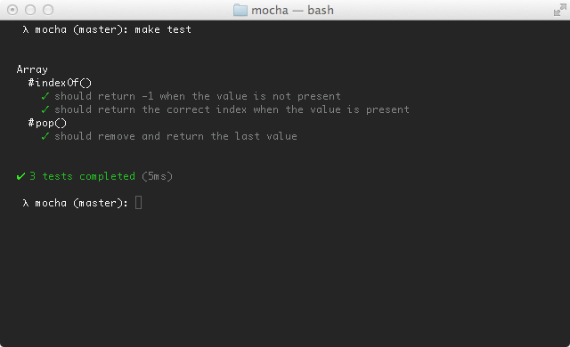
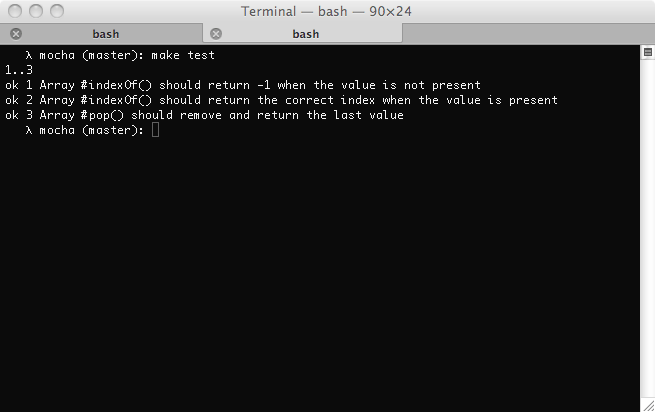
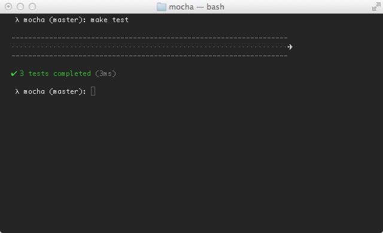
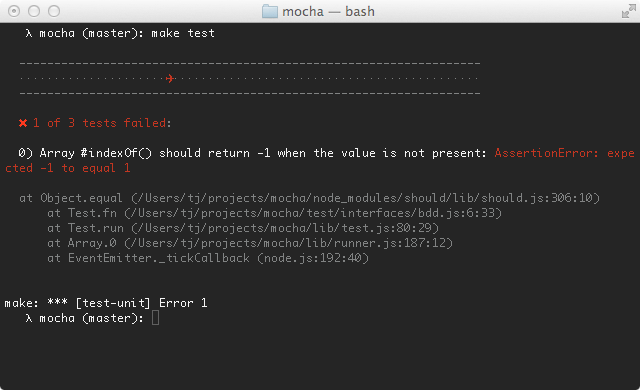
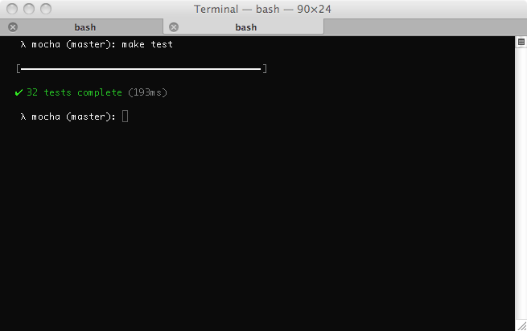
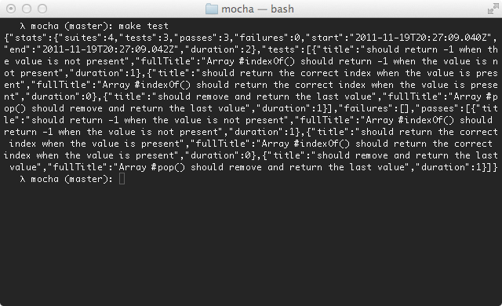
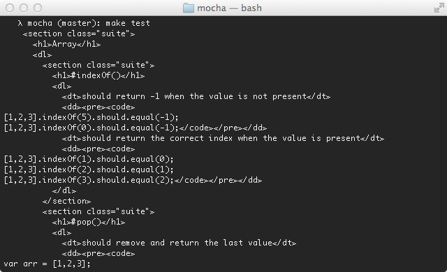
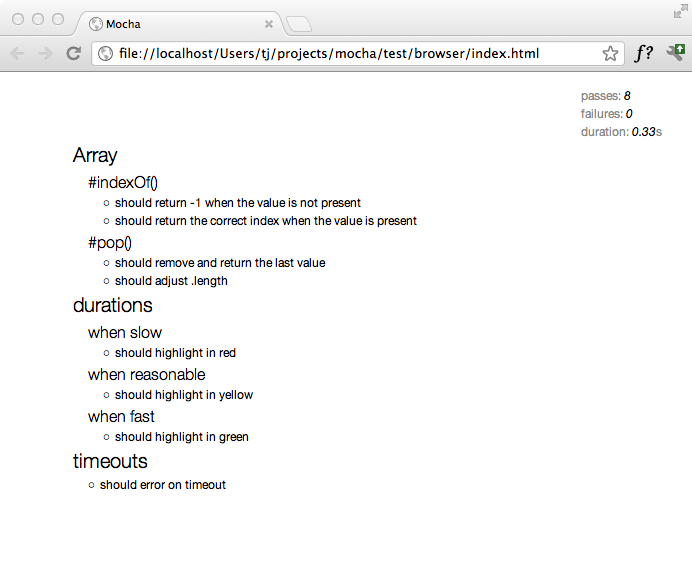

Mocha is a feature-rich JavaScript test framework running on [node](http://nodejs.org) and the browser, making asynchronous testing simple and fun. Mocha tests run serially, allowing for flexible and accurate reporting, while mapping uncaught exceptions to the correct test cases. Hosted on [GitHub](http://github.com/visionmedia/mocha).

## Features

  - browser support
  - simple async support
  - proper exit status for CI support etc
  - auto-detects and disables coloring for non-ttys
  - maps uncaught exceptions to the correct test case
  - async test timeout support
  - test-specific timeouts
  - growl notification support
  - reports test durations
  - highlights slow tests
  - file watcher support
  - global variable leak detection
  - optionally run tests that match a regexp
  - auto-exit to prevent "hanging" with an active loop
  - easily meta-generate suites & test-cases
  - mocha.opts file support
  - node debugger support
  - detects multiple calls to `done()`
  - use any assertion library you want
  - extensible reporting, bundled with 9+ reporters
  - extensible test DSLs or "interfaces"
  - before, after, before each, after each hooks
  - coffee-script support
  - TextMate bundle
  - and more!

## Installation

  Install with [npm](http://npmjs.org):

    $ npm install -g mocha

## Assertions

Mocha allows you to use any assertion library you want, if it throws an error, it will work! This means you can utilize libraries such as [should.js](http://github.com/visionmedia/should.js), node's regular `assert` module, or others. The following is a list of known assertion libraries for node and/or the browser:

  - [should.js](http://github.com/visionmedia/should.js) BDD style shown throughout these docs
  - [expect.js](https://github.com/LearnBoost/expect.js) expect() style assertions
  - [chai](http://chaijs.com/) expect(), assert() and should style assertions

## Synchronous code

 When testing synchronous code, omit the callback and Mocha will automatically continue on to the next test.

    describe('Array', function(){
      describe('#indexOf()', function(){
        it('should return -1 when the value is not present', function(){
          [1,2,3].indexOf(5).should.equal(-1);
          [1,2,3].indexOf(0).should.equal(-1);
        })
      })
    })

## Asynchronous code

Testing asynchronous code with Mocha could not be simpler! Simply invoke the callback when your test is complete:

    describe('User', function(){
      describe('#save()', function(){
        it('should save without error', function(done){
          var user = new User('Luna');
          user.save(function(err){
            if (err) throw err;
            done();
          });
        })
      })
    })

 To make things even easier, the `done()` callback accepts an error, so we may use this directly:

    describe('User', function(){
      describe('#save()', function(){
        it('should save without error', function(done){
          var user = new User('Luna');
          user.save(done);
        })
      })
    })

  All "hooks", that is `before()`, `after()`, `beforeEach()`, `afterEach()` may be sync or async as well, behaving much like a regular test-case. For example you may wish to populate database with dummy content before each test:
  
    describe('Connection', function(){
      var db = new Connection
        , tobi = new User('tobi')
        , loki = new User('loki')
        , jane = new User('jane');

      beforeEach(function(done){
        db.clear(function(err){
          if (err) return done(err);
          db.save([tobi, loki, jane], done);
        });
      })

      describe('#find()', function(){
        it('respond with matching records', function(done){
          db.find({ type: 'User' }, function(err, res){
            if (err) return done(err);
            res.should.have.length(3);
            done();
          })
        })
      })
    })

## Pending tests

 Pending test-cases are simply those without a callback:

    describe('Array', function(){
      describe('#indexOf()', function(){
        it('should return -1 when the value is not present')
      })
    })

## Test duration

  Most of the reporters support some form of displaying
  test duration, as well as flagging tests that are slow,
  as shown here with the "spec" reporter:

   

## mocha(1)

  Usage: mocha [options] [files]

  Options:

    -h, --help             output usage information
    -V, --version          output the version number
    -r, --require <name>   require the given module
    -R, --reporter <name>  specify the reporter to use
    -u, --ui <name>        specify user-interface (bdd|tdd|exports)
    -g, --grep <pattern>   only run tests matching <pattern>
    -t, --timeout <ms>     set test-case timeout in milliseconds [2000]
    -s, --slow <ms>        "slow" test threshold in milliseconds [75]
    -w, --watch            watch files for changes
    -C, --no-colors        force disabling of colors
    -c, --colors           force enabling of colors
    -G, --growl            enable growl notification support
    -d, --debug            enable node's debugger
    -b, --bail             bail after first test failure
    --globals <names>      allow the given comma-delimited global [names]
    --ignore-leaks         ignore global variable leaks
    --interfaces           display available interfaces
    --reporters            display available reporters

### -w, --watch

  Executes tests on changes to the test files.

### -b, --bail

  Only interested in the first exception? use `--bail` !

### -d, --debug

  Enables node's debugger support, this executes your script(s) with `node debug <file ...>` allowing you to step through code and break with the __debugger__ statement.

### --globals &lt;names&gt;

  Accepts a comma-delimited list of accepted global variable names. For example suppose your app deliberately exposes a global named `app` and `YUI`, you may want to add `--globals app,YUI`.

### --ignore-leaks

  By default Mocha will fail when global variables are introduced, you may use `--globals` to specify a few, or use `--ignore-leaks` to disable this functionality. 

### -r, --require &lt;name&gt;

  The `--require` option is useful for libraries such as [should.js](http://github.com/visionmedia/should.js), so you may simply `--require should` instead of manually invoking `require('should')` within each test file.

### -u, --ui &lt;name&gt;

  The `--ui` option lets you specify the interface to use, defaulting to "bdd".
  
### -R, --reporter &lt;name&gt;

  The `--reporter` option allows you to specify the reporter that will be used, defaulting to "dot".
  
### -t, --timeout &lt;ms&gt;

  Specifies the test-case timeout, defaulting to 2 seconds. To override you may pass the timeout in milliseconds, or a value with the `s` suffix, ex: `--timeout 2s` or `--timeout 2000` would be equivalent.

### -s, --slow &lt;ms&gt;

  Specify the "slow" test threshold, defaulting to 75ms. Mocha uses this to highlight test-cases that are taking too long.

### -g, --grep &lt;pattern&gt;

  The `--grep` option when specified will trigger mocha to only run tests matching the given `pattern` which is internally compiled to a `RegExp`. 
  
  Suppose for example you have "api" related tests, as well as "app" related tests, as shown in the following snippet; One could use `--grep api` or `--grep app` to run one or the other. The same goes for any other part of a suite or test-case title, `--grep users` would be valid as well, or even `--grep GET`.

    describe('api', function(){
      describe('GET /api/users', function(){
        it('respond with an array of users')
      })
    })
    
    describe('app', function(){
      describe('GET /users', function(){
        it('respond with an array of users')
      })
    })

## Interfaces

  Mocha "interface" system allows developers to choose their style of DSL. Shipping with __BDD__, __TDD__, and __exports__ flavoured interfaces.

### BDD

  The "__BDD__" interface provides `describe()`, `it()`, `before()`, `after()`, `beforeEach()`, and `afterEach()`: 

    describe('Array', function(){
      before(function(){
        // ...
      });

      describe('#indexOf()', function(){
        it('should return -1 when not present', function(){
          [1,2,3].indexOf(4).should.equal(-1);
        });
      });
    });

### TDD

  The "__TDD__" interface provides `suite()`, `test()`, `setup()`, and `teardown()`.

    suite('Array', function(){
      setup(function(){
        // ...
      });

      suite('#indexOf()', function(){
        test('should return -1 when not present', function(){
          assert.equal(-1, [1,2,3].indexOf(4));
        });
      });
    });

### Exports

  The "__exports__" interface is much like Mocha's predecessor [expresso](http://github.com/visionmedia/expresso). The keys `before`, `after`, `beforeEach`, and `afterEach` are special-cased, object values
  are suites, and function values are test-cases.

    module.exports = {
      before: function(){
        // ...
      },

      'Array': {
        '#indexOf()': {
          'should return -1 when not present': function(){
            [1,2,3].indexOf(4).should.equal(-1);
          }
        }
      }
    };

## Reporters

  Mocha reporters adjust to the terminal window,
  and always disable ansi-escape colouring when
  the stdio streams are not associated with a tty.

### Dot Matrix

  The "dot" matrix reporter is simply a series of dots
  that represent test cases, failures highlight in red,
  pending in blue, slow as yellow.

   

### Spec

  The "spec" reporter outputs a hierarchical view
  nested just as the test cases are.

   
   

### TAP

  The TAP reporter emits lines for a [Test-Anything-Protocol](http://en.wikipedia.org/wiki/Test_Anything_Protocol) consumer.

  

### Landing Strip

  The Landing Strip reporter is a gimmicky test reporter simulating
  a plane landing :) unicode ftw

  
  

### List

  The "List" reporter outputs a simple specifications list as
  test cases pass or fail, outputting the failure details at 
  the bottom of the output.

  

### Progress

  The progress reporter implements a simple progress-bar:

  

### JSON

  The JSON reporter outputs a single large JSON object when
  the tests have completed (failures or not).
  
  

### JSON Stream

  The JSON Stream reporter outputs newline-delimited JSON "events" as they occur, beginning with a "start" event, followed by test passes or failures, and then the final "end" event.

  

### Doc

 The "doc" reporter outputs a hierarchical HTML body representation
 of your tests, wrap it with a header, footer, some styling and you
 have some fantastic documentation!

  

 For example suppose you have the following JavaScript:

    describe('Array', function(){
      describe('#indexOf()', function(){
        it('should return -1 when the value is not present', function(){
          [1,2,3].indexOf(5).should.equal(-1);
          [1,2,3].indexOf(0).should.equal(-1);
        })
      })
    })

 The command `mocha --reporter doc array` would yield:

    <section class="suite">
      <h1>Array</h1>
      <dl>
        <section class="suite">
          <h1>#indexOf()</h1>
          <dl>
          <dt>should return -1 when the value is not present</dt>
          <dd><pre><code>[1,2,3].indexOf(5).should.equal(-1);
    [1,2,3].indexOf(0).should.equal(-1);</code></pre></dd>
          </dl>
        </section>
      </dl>
    </section>

  The SuperAgent request library [test documentation](http://visionmedia.github.com/superagent/docs/test.html) was generated with Mocha's doc reporter using this simple make target:
  
    test-docs:
    	make test REPORTER=doc \
    		| cat docs/head.html - docs/tail.html \
    		> docs/test.html

  View the entire [Makefile](https://github.com/visionmedia/superagent/blob/master/Makefile) for reference.

### XUnit

   Documentation needed.

### TeamCity

   Documentation needed.

### HTML

 The __HTML__ reporter is currently the only browser reporter
 supported by Mocha, and it looks like this:
 
 

## Browser support

 Mocha runs in the browser. Every release of Mocha will have new builds of _./mocha.js_ and _./mocha.css_ for use in the browser. To setup Mocha for browser use all you have to do is include the script, stylesheet, tell Mocha which interface you wish to use, and then run the tests. A typical setup might look something like the following, where we call `mocha.setup('bdd')` to use the __BDD__ interface before loading the test scripts, running them `onload` with `mocha.run()`.

    <html>
    <head>
      <meta charset="utf-8">
      <title>Mocha Tests</title>
      <link rel="stylesheet" href="https://raw.github.com/visionmedia/mocha/master/mocha.css" />
      
      
      
      
      
      
      
      
    </head>
    <body>
      

    </body>
    </html>

  Feel free to hot-link the [mocha.css](https://raw.github.com/visionmedia/mocha/master/mocha.css) and [mocha.js](https://raw.github.com/visionmedia/mocha/master/mocha.js) from GitHub.

### grep

  The client-side may utilize `--grep` as well, however you use the query-string, for example `?grep=api`.

## mocha.opts

 Mocha will attempt to load `./test/mocha.opts`, these are concatenated with `process.argv`, though command-line args will take precedence. For example suppose you have the following _mocha.opts_ file:

    --require should
    --reporter dot
    --ui bdd

  This will default the reporter to `dot`, require the `should` library,
  and use `bdd` as the interface. With this you may then invoke `mocha(1)`
  with additional arguments, here enabling growl support and changing
  the reporter to `spec`:

    $ mocha --reporter list --growl

## Test specific timeouts

  To compliment the global `--timeout` option, you may also specific test-specific timeouts via `this.timeout()`, or disable the timeout all-together with `this.timeout(0)`.

    it('should take less than 500ms', function(done){
      this.timeout(500);
      setTimeout(done, 300);
    })

## Best practices

### test/*

 By default `mocha(1)` will use the pattern `./test/*.js`, so
 it's usually a good place to put your tests.

### Makefiles

 Be kind and don't make developers hunt around in your docs to figure
 out how to run the tests, add a `make test` target to your _Makefile_:

     test:
       ./node_modules/.bin/mocha \
         --reporter list
     
     .PHONY: test

## Editors

  The following editor-related packages are available:

### TextMate bundle

  The Mocha TextMate bundle includes snippets to
  make writing tests quicker and more enjoyable.
  To install the bundle run:

      $ make tm

## Example test suites

  The following test suites are from real projects putting Mocha to use,
  so they serve as good examples:
  
   - [Express](https://github.com/visionmedia/express/tree/master/test)
   - [Connect](https://github.com/senchalabs/connect/tree/master/test)
   - [SuperAgent](https://github.com/visionmedia/superagent/tree/master/test/node)
   - [WebSocket.io](https://github.com/LearnBoost/websocket.io/tree/master/test)
   - [Mocha](https://github.com/visionmedia/mocha/tree/master/test)

## Running mocha's tests

 Run the tests:

       $ make test

 Run all tests, including interfaces:

       $ make test-all

 Alter the reporter:

       $ make test REPORTER=list

